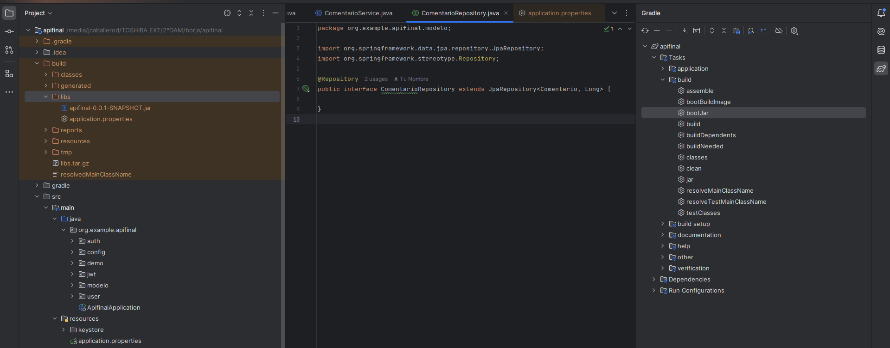
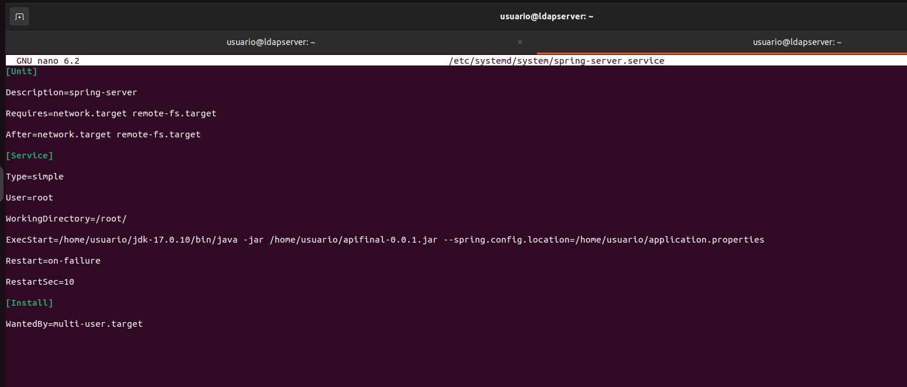
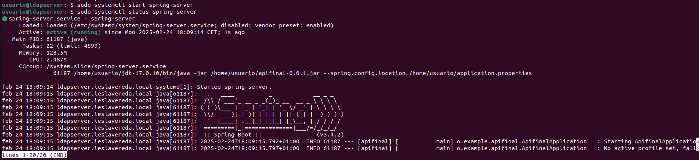
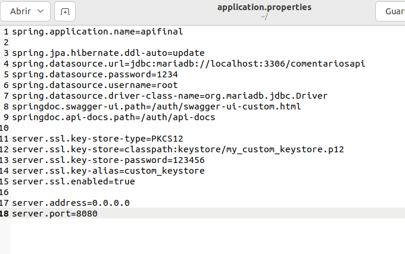

Para crear el servicio primero tenemos que crear el archivo .jar. 

Para ello en la parte derecha nos sale el icono de gradle y tenemos que presionar ahí para que se despliegue una pestaña donde seleccionamos la carpeta build y luego doble clic en bootjar. 

Una vez termina de ejecutarse podemos ver el archivo .jar en la carperta build/libs, que en esta misma carpeta vamos a mover el archivo application.properties. 

Ahora vamos a nuestra máquina vamos a crear el archivo de configuración del servicio y lo vamos a configurar. 

sudo nano /etc/systemd/system/spring-server.service 

Ahora ya podemos acceder al servicio desde los comandos. 

Por último, yo tuve que poner un par de líneas extra en el application.properties para poder hacer las llamadas al api. 

